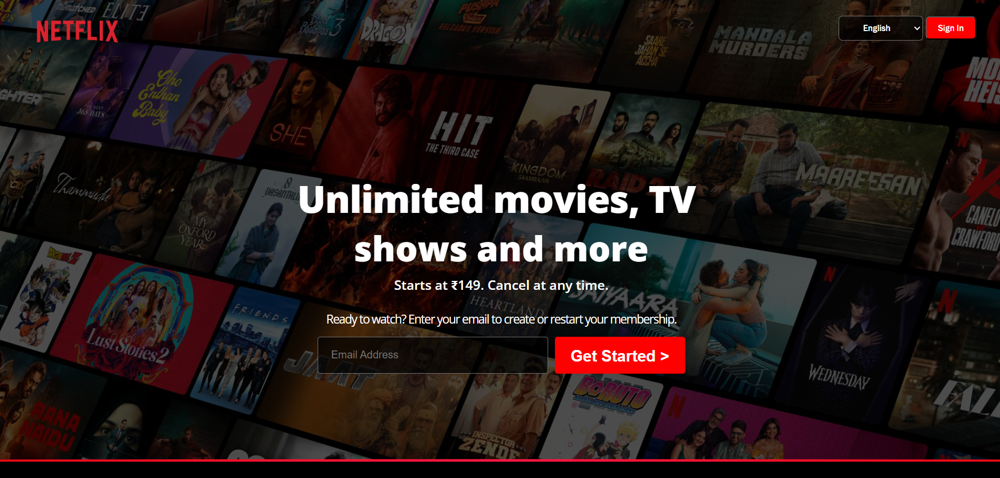

# Netflix Homepage Clone

A high-fidelity front-end clone of the Netflix landing page built to practice responsive CSS layouts and modern web design principles.

## 🚀 Features
- **Responsive Design**: Fully functional on Desktop, Tablet, and Mobile devices.
- **Interactive Components**: Hover effects, accordion FAQ section, and styled input fields.
- **Pixel-Perfect CSS**: Focus on matching Netflix's specific branding, typography, and spacing.

## 🛠️ Tech Stack
- **HTML5**: Semantic structure.
- **CSS3**: Custom properties (variables), Flexbox, and CSS Grid.

## 📸 Preview

## 📂 Project Structure
- `index.html` - The main entry point.
- `style.css` - Custom styling and animations.
- `/images` - Optimized assets used in the project.
